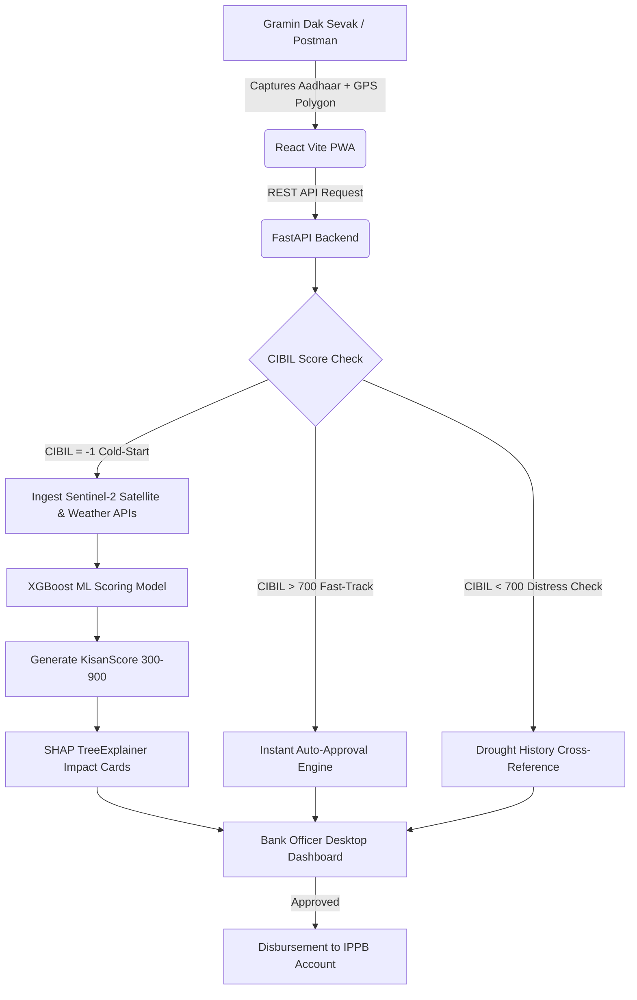

# 🌾 KisanScore - AI Powered Alternative Credit Scoring for Unbanked Farmers
> **Internal Hackathon**  
> **Theme:** Miscellaneous
> **Team:** Code Catalyst

---

## 📌 Executive Summary
**KisanScore** is an AI-powered alternative credit-scoring platform designed for **India Post Payments Bank (IPPB)** to safely extend institutional micro-loans to "Thin-File" smallholder farmers who operate in a cash economy and have a **CIBIL Score of -1 (No History)**.

By leveraging Gramin Dak Sevaks (Postmen) for doorstep GPS polygon capture, **KisanScore** evaluates 5-year historical Sentinel-2 satellite vegetation index (NDVI), soil quality, and climate anomalies using **XGBoost** and **SHAP Explainable AI**—translating agricultural potential into a fair, transparent credit score (300–900).

---

## 🚀 Key Features & Innovations

- **🚪 Doorstep Biometric Onboarding (PWA):** Gramin Dak Sevaks capture Aadhaar e-KYC and boundary coordinates on the field with offline-first caching.
- **🛰️ Tri-Route Decision Engine:**
  - **Route A (Cold-Start / CIBIL = -1):** Fetches satellite biomass (NDVI) + soil/weather parameters to evaluate creditworthiness purely from farm viability.
  - **Route B (Fast-Track / CIBIL > 700):** Automated fast-track credit limits for experienced borrowers.
  - **Route C (Climate Distress Check / CIBIL < 700):** Cross-references default years with historical drought anomalies (distinguishes victims of drought from willful defaulters).
- **🧠 RBI-Compliant Explainable AI (XAI):** Uses **SHAP (SHapley Additive exPlanations)** to generate human-readable "Impact Cards" explaining the exact rationale for every loan decision to bank officers.
- **⚡ Zero-Cost Infrastructure:** Integrates seamlessly into IPPB’s existing network of 1.5 Lakh rural post offices and micro-ATMs.

---

## 🏗️ System Architecture Flow



---

## 🛠️ Technology Stack

| Layer | Technologies | Purpose |
| :--- | :--- | :--- |
| **Frontend** | React 18, Vite, Tailwind CSS, Lucide Icons, Leaflet Maps | Responsive PWA for Postman data entry & Bank Officer analytics |
| **Backend** | FastAPI (Python 3.13), Uvicorn, Pydantic, SQLite | High-performance asynchronous REST API backend |
| **AI / ML Engine** | XGBoost, Scikit-Learn, Joblib | Non-linear credit risk probability & score generation |
| **Explainable AI** | SHAP (TreeExplainer) | Feature attribution & mathematical decision transparency |
| **Data & APIs** | Sentinel-2 (Copernicus), Open-Meteo, Agmarknet, UIDAI | Remote sensing biomass, historical rainfall, and crop pricing |

---

## 📂 Repository Structure

```
KisanScore/
├── backend/
│   ├── main.py              # FastAPI application & REST endpoints
│   ├── routing_logic.py     # Tri-Route scoring dispatcher (A/B/C)
│   ├── database.py          # SQLite persistence & auto-seed layer
│   ├── middleware.py        # CORS & security headers
│   └── requirements.txt     # Backend Python dependencies
├── frontend/
│   ├── src/
│   │   ├── api/client.js    # Resilient API client with fallback data
│   │   ├── pages/
│   │   │   ├── Gateway.jsx  # Landing & role selection portal
│   │   │   ├── Postman.jsx  # Field data entry & GPS Polygon mapping
│   │   │   └── Dashboard.jsx# Bank Officer underwriting & SHAP gauge
│   │   ├── App.jsx          # Route configuration
│   │   └── main.jsx         # App bootstrapping
│   ├── package.json         # Node.js dependencies
│   └── vite.config.js       # Vite build configuration
├── ml_engine/
│   ├── dataset.csv          # 2,000+ farmer training records
│   ├── train.py             # XGBoost model training pipeline
│   ├── inference.py         # Production scoring API interface
│   ├── generate_shap.py     # SHAP explainability card generator
│   ├── xgboost_model.joblib # Serialized production model weights
│   └── preprocessor.joblib  # Feature scaling pipeline
└── README.md                # Project documentation
```

---

## ⚡ Quick Start & Installation

### 1. Prerequisites
- **Python 3.10+** (with `py` launcher or `python`)
- **Node.js 18+** & `npm`

### 2. Backend Setup
```bash
# Navigate to backend directory
cd backend

# Install Python requirements
py -m pip install -r requirements.txt

# Start the FastAPI server
py -m uvicorn main:app --reload --port 8000
```
* Backend will be live at: `http://localhost:8000`
* Interactive API Documentation (Swagger): `http://localhost:8000/docs`

### 3. Frontend Setup
```bash
# Open a new terminal and navigate to frontend directory
cd frontend

# Install Node dependencies
npm install

# Start the Vite development server
npm run dev
```
* Web Application will be live at: `http://localhost:5173`

---

## 📡 API Contract Overview

| Method | Endpoint | Description |
| :--- | :--- | :--- |
| `POST` | `/api/v1/applications` | Submit new farmer application with GPS polygon |
| `GET` | `/api/v1/applications` | List pending applications for bank officer queue |
| `GET` | `/api/v1/applications/{id}/score` | Fetch KisanScore (300-900), NDVI, and SHAP cards |
| `POST` | `/api/v1/applications/{id}/decision` | Record officer loan decision (Approve / Reject) |

---

